# Spring Batch

정수원님 배치강의 수강
[spring batch](https://www.inflearn.com/course/%EC%8A%A4%ED%94%84%EB%A7%81-%EB%B0%B0%EC%B9%98#curriculum)

1. 스프링 배치 소개
2. 시작
3. 도메인 이해
4. 실행
5. 청크 프로세스 (1)
6. 청크 프로세스 (2)
7. 반복 및 오류 제어
8. 멀티 스레드 프로세싱
9. 리스너
10. 테스트 및 운영

##### 1. 스프링 배치 탄생 배경

- 자바 기분 표준 배치 기술 부재
    - 배치 처리에서 요구하는 재사용 가능한 자바 기반 배치 아키텍처 표준의 필요성이 대두
- 스프링 배치는 SpringSource와 Accenture의 합작품
    - Accenture - 배치 아키텍처를 구현하면서 쌓은 기술적인 경험과 노하우
    - SpringSource - 깊이 있는 기술적 기반과 스프링의 프로그램이 모델

##### 2. 배치 핵심 패턴

- Read - 데이터베이스, 파일, 큐에서 다량의 데이터 조회 (Extract)
- Process - 특정 방법으로 데이터를 가공 (Transform)
- Write - 데이터를 수정된 양식으로 다시 저장 (Load)

##### 3. 배치 시나리오

- 배치 프로세스를 주기적으로 커밋
- 동시 다발적인 Job의 배치 처리, 대용량 병렬 처리
- 실패 후 수동 또는 스케줄링에 의한 재시작
- 의존관계가 있는 step 여러 개를 순차적으로 처리
- 조건적 Flow 구성을 통한 체계적이고 유연한 배치 모델 구성
- 반복, 재시도, Skip 처리

#### 아키텍처

Application

- 스프링 배치 프레임워크를 통해 개발자가 모든 배치 Job과 커스텀 코드를 포함
- 개발자는 엄부로직의 구현에만 집중하고 공통적인 기반기술은 프레임웍이 담당하게 한다.

Batch Core

- Job을 실행, 모니터링, 관리하는 API로 구성되어 있다.
- JobLauncher, Job, Step, Flow 등이 속한다.

Batch Infrastructure

- Application Core 모두 공통 Infrastructure 위에서 빌드한다.
- Job 실행의 흐름과 처리를 위한 틀을 제공함
- Reader, Processor, Writer, Skip, Retry 등이 속한다.

#### 스프링 배치 활성화

- @EnableBatchProcessing
    - 총 4개의 설정 클래스를 실행시키며 스프링 배치의 모든 초기화 및 실행 구성이 이루어진다
    - 스프링 부트 배치의 자동 설정 클래스가 실행됨으로 빈으로 등록된 모든 Job을 검색해서 초기화와 동시에 Job을 수행하도록 구성됨

1. BatchAutoConfiguration

- Job을 수행하는 JobLauncherApplicationRunner

2. SimpleBatchConfiguration

- JobBuilderFactory 와 StepBuilderFactory 생성
- 스프링 배치의 주요 구성 요소 생성 - 프록시 객체로 생성됨

3. BatchConfigurerConfiguration

- BasicBatchConfigurer
    - SimpleBatchConfiguration 에서 생성한 프록시 객체의 시제 대상 객체를 생성하는 설정 클래스
    - 빈으로 의존성 주입 받아서 주요 객체들을 참조해서 사용할 수 있다.
    - JpaBatchConfigurer

```java
1.@Configuration 선언
        -하나의 배치 Job을 정의하고 빈 설정

        2.JobBuilderFactory
        -Job 을 생성하는 빌더 팩토리
        3.StepBuilderFactory
        -Step을 생성하는 빌더 팩토리
        4.Job
        -Job 생성
        5.Step
        -Step 생성
        6.tasklet
        -step 안에서 단일 태스크로 수행되는 로직 구현
        7.Job 구동->Step을 실행->Tasklet을 실행
```

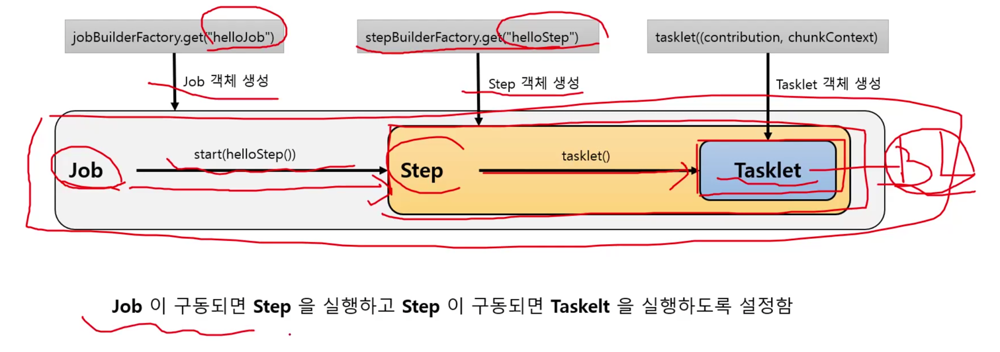

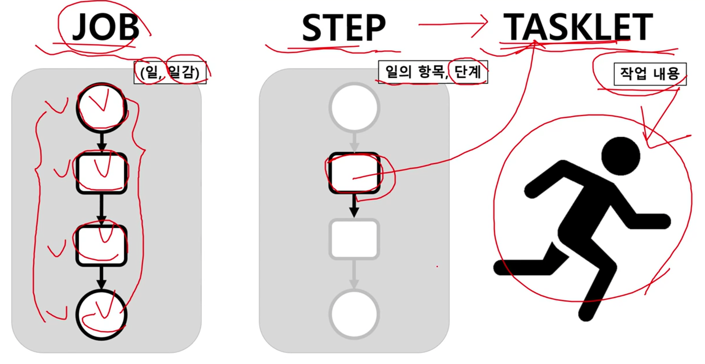

### 스프링 배치 시작 - DB 스키마 생성

1. 스프링 배치 메타 데이터

- 스프링 배치의 실행 및 관리를 위한 목적으로 여러 도메인들 (Job, Step, JobParameters)의 정보들을 저장, 업데이트, 조회할 수 있는 스키마 제공
- 과거, 현재의 실행에 대한 세세한 정보, 실행에 대한 성공과 실패 여부 등을 일목요연하게 관리함으로서 배치운옹에 있어 리스크 발생시 빠른 대처 가능
- DB와 연동할 경우 필수적으로 메타 테이블이 생성 되어야 함

2. DB스키마 제공

- 파일 위치 : /org/springframework/batch/core/schema-*.sql
- db 유형별로 제공

3. 스키마 생성 설정

- 수동 생성 - 쿼리 복사 후 직접 실행
- 자동 생성 - spring.batch.jdbc.initialize-schema 설정
    - always : 스크립트 항상 실행, RDBMS 설정이 되어 있을 경우 내장 DB보다 우선적으로 실행
    - embedded : 내장 db일 때만 실행되며 스키마가 자동 생성되, 기본값
    - never : 스크립트 항상 실행 안함, 내장 db 일 경우 스크립트가 생성이 안되기 때문에 오류 발생, 운영에서 수동으로 스크립트 생성 후 설정하는 것을 권장


- 배치 실행을 위한 메타 데이터가 저장되는 테이블

Job 관련 테이블

- BATCH_JOB_INSTANCE
    - Job이 실행되며 생성되는 최상위 계층의 테이블, job_name과 job_key로 중복 저장될 수 없다.
- BATCH_JOB_EXECUTION
    - Job이 실행되는 동안 시작/종료 시간, job등을 관리
- BATCH_JOB_EXECUTION_PARAMS
    - Job을 실행하기 위해 주입된 parameter 정보 저장
- BATCH_JOB_EXECUTION_CONTEXT
    - Job이 실행되며 공유해야할 데이터를 직렬화해 저장(json)

Step 관련 테이블

- BATCH_STEP_EXECUTION
    - Step이 실행되는 동안 필요한 데이터 또는 실행된 결과 저장
- BATCH_STEP_EXECUTION_CONTEXT
    - Step이 실행되며 공유해야할 데이터를 직렬화해 저장, step 별로 저장되며 step 간 서로 공유할 수 없음

-> batch -> core 밑에 sql 밑에 존재

### 스프링 배치 도메인 이해

1. Job
    - Job
    - JobInstance
    - JobParameters
    - JobExecution
2. Step
3. ExecutionContext
4. JobRepository / JobLauncher

#### Job

1. 기본 개념

- 배치 계층 구조에서 가장 상위에 있는 개념으로서 하나의 배치작업 자체를 의미함
    - API 서버의 접속 로그 데이터를 통계 서버로 옮기는 배치인 Job 자체를 의미한다.
- Job Configuration 을 통해 생성되는 객체 단위로서 배치작업을 어떻게 구성하고 실행할 것인지 전체적으로 설정하고 명세해 놓은 객체
- 배치 Job을 구성하기 위한 최상위 인터페이스이며 스프링 배치가 기본 구현체를 제공한다.
- 여러 Step을 포함하고 있는 컨테이너로서 반드시 한개 이상의 Step으로 구성해야 함


2. 기본 구현체

- SimpleJob
    - 순차적으로 Step을 실행시키는 Job
- FlowJob
    - 특정한 조건과 흐름에 따라 Step 을 구성하여 실행시키는 Job

JobParameters | JobLauncher ->              Job execute (Step, Step, Step)
run(job, parameters)

Job <- AbstractJob  <- (SimpleJob, FlowJob)

### JobInstance

1. 기본 개념
    - Job이 실행될 때 생성되는 Job의 논리적 실행 단위 객체로서 고유하게 식별 가능한 작업 실행을 나타냄
    - Job의 설정과 구성은 동일하지만 Job이 실행되는 시점에 처리하는 내용은 다르기 때문에 Job의 실행을 구분해야 함
        - 예를 들어 하루에 한 번 씩 배치 Job이 실행된다면 매일 실행되는 각각의 Job을 JobInstance로 표현한다.
    - JobInstance 생성 및 실행
        - 처음 시작하는 Job + JobParameter 일 경우 새로운 JobInstance 생성
        - 이전과 동일한 Job + JobParameter로 실행 할 경우 이미 존재하는 JobInstance 리턴
            - 내부적으로 JobNmae + jobKey 를 가지고 JobInstance 객체를 얻음
    - Job 과는 1:M 관계

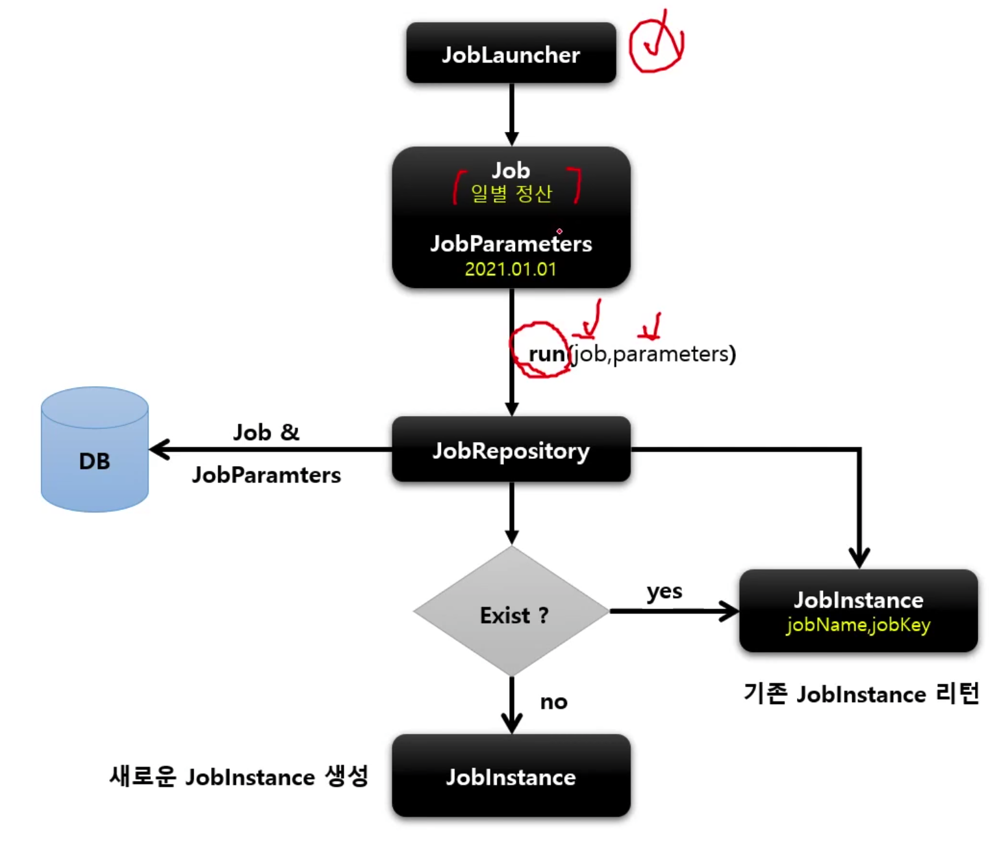

JobInstance = Job + JobParameters (BATCH_JOB_INSTANCE)에 저장

### JobParameter

1. 기본 개념
    - Job을 실행할 때 함께 포함되어 사용되는 파라미터를 가진 도메인 객체
    - 하나의 Job에 존재할 수 있는 여러개의 JobInstance를 구분하기 위한 용도
    - JobParameters와 JobInstance 1:1 관계

2. 생성 및 바인딩
    - 어플리케이션 실행 시 주입
        - Java -jar LogBatch.jar requestDate = 20210101
    - 코드로 생성
        - JobParameterBuilder, DefaultJobParametersConverter
    - SpEL 이용
        - @Value("#{jobParameter[requestDate]}"), @JobScope, @StepScope 선언 필수

3. BATCH_JOB_EXECUTION_PARAM 테이블과 매핑
    - JOB_EXECUTION 과 1:M 의 관계

> name=user1 seq(long)=2 date(date)=2021/10/25

### JobExecution

1. 기본 개념
    - JobInstance 에 대한 한 번의 시도를 의미하는 객체로서 Job실행 중에 발생한 정보들을 저장하고 있는 객체
        - 시작시간, 종료시간, 상태, 종료상태의 속성을 가짐
    - JobInstance 와의 관계
        - JobExecution은 FAILED, COMPLETED 등의 Job의 실행 결과 상태를 가지고 있음
        - COMPLETED이면 재실행 불가
        - FAILED이면 재실행이 가능
        - COMPLETED 될 떄까지 하나의 JobInstance 내에서 여러 번의 시도가 생길 수 있음
2. BATCH_JOB_EXECUTION 테이블과 매핑
    - JobInstance와 1:M

### Step

1. 기본 개념
    - Batch Job을 구성하는 독립적인 하나의 단계로서 실제 배치 처리를 정의하고 컨트롤하는 데 필요한 모든 정보를 가지고 있는 도메인 객체
    - 단순한 단일 태스크 뿐 아니라 입력과 처리 그리고 출력과 관련된 복잡한 비즈니스 로직을 포함하는 모든 설정들을 담고 있다.
    - 배치작업을 어떻게 구성하고 실행할 것인지 Job의 세부 작업을 Task 기반으로 설정하고 명세해 놓은 객체
    - 모든 Job은 하나 이상의 step으로 구성

2. 기본 구현체
    - TaskletStep
        - 가장 기본이 되는 클래스로서 Tasklet 타입의 구현체들을 제어한다.
    - PartitionStep
        - 멀티 스레드 방식으로 step을 여러 개로 분리해서 실행한다.
    - JobStep
        - Step 내에서 Job을 실행하도록 한다.
    - FlowStep
        - Step 내에서 Flow를 실행하도록 한다. ...

### StepExecution

1. 기본 개념
    - Step에 대한 한 번의 시도를 의미하는 객체로서 Step실행 중에 발생한 정보들을 저장하고 있는 객체
        - 시작시간, 종료시간, 상태, commit count, rollback count등의 속성을 가짐
    - Step이 매번 시도될 때마다 생성되며 각 Step별로 생성
    - Job이 재시작 하더라도 이미 성공적으로 각 Step별로 생성된다.
    - Job이 재시작 하더라도 이미 성공적으로 완료된 Step은 재실행되지 않고 실패한 Step만 실행된다.
    - 이전 단계 Step이 실패해서 현재 Step을 실행하지 않았다면 StepExecution 을 생성하지 않는다. Step이 실제로 시작됐을 때만 StepExecution을 생성한다.
    - JobExecution 과의 관계
        - Step의 StepExecution 이 모두 정상적으로 완료 되어야 JobExecution이 정상적으로 완료된다.
        - Step의 StepExecution 중 하나라도 실패하면 JobExecution은 실패한다.

2. BATCH_STEP_EXECUTION 테이블과 매핑
    - JobExecution 와 StepExecution 은 1:M 의 관계
    - 하나의 Job에 여러 개의 Step으로 구성했을 경우 각 StepExecution은 하나의 JobExecution을 부모로 가진다.

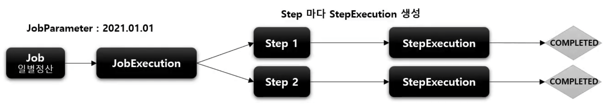

### StepContribution

1. 기본 개념
    - 청크 프로세스의 변경 사항을 버퍼링 한 후 StepExecution 상태를 업데이트하는 도메인 객체
    - 청크 커밋 직전에 StepExecution 의 apply 메서드를 호출하여 상태를 업데이트 함
    - ExitStatus 의 기본 종료코드 외 사용자 정의 종료코드를 생성해서 적용 할 수 있다

TaskletStep -> StepExecution -> StepContribution | ChunkOrientedTasklet

### ExecutionContext

1. 기본 개념
    - 프레임워크에서 유지 및 관리하는 키/값으로 된 컬렉션으로 StepExecution 또는 JobExecution 객체의 상태를 저장하는 공유 객체
    - DB에 직렬화 한 값으로 저장됨
    - 공유 범위
        - Step 범위 - 각 Step의 StepExecution에 저장되며 Step 간 서로 공유 안 됨
        - Job 범위 - 각 Job의 JobExecution에 저장되며 Job 간 서로 공유 안 되며 해당 Job의 Step간 서로 공유됨
    - Job 재 시작시 이미 처리한 Row 데이터는 건너뛰고 이후로 수행하도록 할 때 상태 정보를 활용한다.

2. 유지 관리에 필요한 키값 설정

```java
Map<String, Object> map=new ConcurrentHashMap
```

### JobRepository

1. 기본 개념
    - 배치 작업 중의 정보를 저장하는 저장소 역할
    - Job이 언제 수행되었고, 언제 끝났으며, 몇 번이 실행되었고 실행에 대한 결과 등의 배치 작업의 수행과 관련된 모든 meta data를 저장함
        - JobLauncher, Job, Step 구현체 내부에서 CRUD 기능을 처리함

- JobRepository 설정
    - @EnableBatchProcessing 어노테이션만 선언하면 JobRepository가 자동으로 빈으로 생성
    - BatchConfigurer 인터페이스를 구현하서나 BasicBatchConfigurer를 상속해서 JobRepository 설정을 커스터마이징 할 수 있다
        - JDBC방식으로 설정 - JobRepositoryFactoryBean
            - 내부적으로 AOP 기술을 통해 트랜잭션 처리를 해주고 있음
            - 트랜잭셩 isolation의 기본값은 SERIALIZEBLE 로 최고 수준, 다른 레벨로 지정 가능
            - 메타테이블의 Table Prefix를 변경할 수 있음 기본값은 BATCH_ 임
    - In Memory 방식으로 설정 - MApJobRepositoryFactoryBean
        - 성능 등의 이유로 도매인 오브젝트를 굳이 데이터베이스에 저장하고 싶지 않을 경우
        - test or proto type

### JobLauncher

1. 기본 개념
    - 배치 Job을 실행시키는 역할을 한다.
    - Job과 Job Parameters를 인자로 받으며 요청된 배치 작업을 수행한 후 최종 client에게 JobExecution을 반환함
    - 스프링 부트 배치가 구동이 되면 JobLauncher 빈이 자동 생성 된다.
    - Job실행
        - JobLauncher.run(Job, JobParameters)
        - 스프링 부트 배치에서는 JobLauncherApplicationRunner 가 자동적으로 JobLauncher 을 실행시킨다.
        - 동기적 실행
            - taskExecutor를 SyncTaskExecutor로 설정한 경우 (기본값은 SyncTaskExecutor)
            - JobExecution 을 획득하고 배치 처리를 최종 완료한 이후 Client에게 JobExecution을 반환
            - 스케줄러에 의한 배치처리에 적합 함 - 배치처리시간이 길어도 상관없는 경우
        - 비 동기적 실행
            - taskExecutor가 SimpleAsyncExecutor로 설정할 경우
            - JobExecution을 획득한 후 Client에게 바로 JobExecution을 반환하고 배치처리를 완료한다.
            - HTTP 요청에 의한 배치처리에 적합함 - 배치처리 시간이 길 경우 응답이 늦어지지 않도록 함
2. 구조 JobLauncher

> JobExecution run(Job, JobParameters)

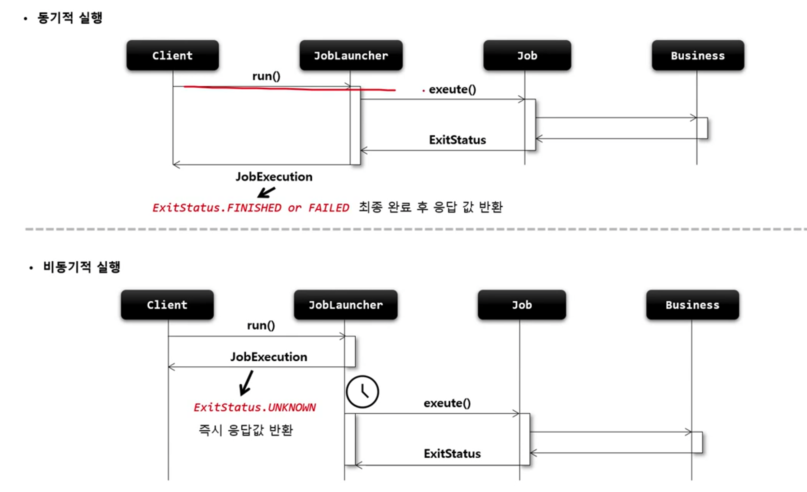

### 배치 초기화 설정

1. JobLauncherApplicationRunner
    - Spring Batch 작업을 시작하는 ApplicationRunner로서 BatchConfiguration에서 생성됨
    - 스프링 부트에서 제공하는 ApplicationRunner의 구현체로 어플리케이션이 정상적으로 구동될때 마다 실행됨
    - 기본적으로 빈으로 등록된 모든 job을 실행시킨다.

2. BatchProperties
    - Spring Batch의 환경 설정 클래스
    - Job이름, 스키마 초기화 설정, 테이블 prefix등의 값을 설정할 ㅅ ㅜ있다.
    - application.properties or applicaion.yml 파일에 설정함

```
batch:
    job:
        names: ${job.name:NONE}
    initialize-schema: NEVER
    tablePrefix: SYSTEM
```

3. Job 실행 옵션
    - 지정한 Batch Job만 실행하도록 할 수 있음
    - spring.batch.job.names
    - 어플리케이션 실행시 Program arguments 로 job 이름 입력한다.
    - --job.name=helloJob, simpleJob

### Job and Step

- JobBuilderFactory & JobBuilder
- SimpleJob
- StepBuilderFactory & StepBuilder
- TaskletStep
- JobStep

### JobBuilderFactory / JobBuilder

1. 스프링 배치는 Job 과 Step 을 쉽게 생성 및 설정할 수 있도록 util 성격의 빌더 클래스들을 제공
2. JobBuilderFactory
    - JobBuilder 를 생성하는 팩토리 클래스로서 get(String name) 메서드 제공
    - jobBuilderFactory.get("jobName")
        - "jobName"은 스프링 배치가 Job을 실행시킬 때 참조하는 Job의 이름

3. JobBuilder
    - Job을 구성하는 설정 조건에 따라 두 개의 하위 빌더 클래스를 생성하고 실제 Job생성을 위임한다.
    - SimpleJobBuilder
        - SimpleJob을 생성하는 Builder 클래스
        - Job실행과 관련된 여러 설정 API 를 제공한다.
    - FlowJobBuilder
        - FlowJob을 생성하는 Builder 클래스
        - 내부적으로 FlowBuilder를 반환함으로써 Flow 실행과 관련된 여러 설정 API를 제공한다

start(step) - SimpleJobBuilder[SimpleJob 생성]

start(flow), flow(step) - FlowJobBuilder -> JobFlowBuilder[Flow 생성]

Builder 들은 SimpleJobBuilder에서 bean으로 생성된다.

### SimpleJob

- 개념 및 API 소개
- API 설정
- 아키텍처

1. 기본 개념

- SimpleJob은 Step을 실행시키는 Job 구현체 SimpleJobBuiler에 의해 생성
- 여러 단계의 Step으로 구성 Step을 순차적으로 실행
- 모든 Step의 실행이 성공적으로 완료되어야 Job이 성공적으로 완료
- 맨 마지막에 실행한 Step의 BatchStatus 가 Job의 최종 BatchStatus가 된다.

simpleJob에 저장되는 항목 - start : 처음 실행 할 Step 설정, 최초 한 번 설정, 이 메서드를 실행하면 SimpleJobBuilder 반환 next : 다음에 실행 할 Step 설정, 횟수는
제한이 없으며 모든 next()의 Step이 종료가 되면 Job이 종료 incrementer : JobParameter의 값을 자동으로 증가해 주는 JobParametersIncremeter 설정
preventRestart : Job의 재시작 가능 여부 설정, validator : JobParameter를 실행하기 전에 올바른 구성이 되었는지 검증하는 JobParametersValidator 설정
listener : Job 라이프 사이클의 특정 시점에 콜백 제공받고록 JobExecutionListener 설정 build : SimpleJob 생성

### validator()

1. 기본개념
    - Job 실행에 꼭 필요한 파라미터를 검증하는 용도
    - DefaultJobParametersValidator 구현체를 지원하며, 좀 더 복잡한 제약 조건이 있다면 인터페이스를 직접 구현할 수 있음

2. 구조

```
JobPrametersValidator
void validate(@Nullable JobParameters parameters)
```

### preventRestart()

1. 기본개념
    - Job 의 재시작 여부를 설정
    - 기본 값은 true이며 false 로 설정 시 이 Job은 재시작을 지원하지 않는다. 라는 의미
    - Job이 실패해도 재시작이 안 되며 Job을 재 시작하려고 하면 JobRestartException 발생
    - 재 시작과 관련 있는 기능으로 Job을 처음 실행하는 것 과는 아무런 상관 없음

### incrementer()

1. 기본개념
    - JobParameters에서 필요한 값을 증가시켜 다음에 사용될 JobParameters 오브젝트를 리턴
    - 기존의 JobParameter 변경없이 Job을 여러 번 시작하고자 할때
    - RunIdIncrementer 구현체를 지원하며 인터페이스를 직접 구현할 수 있음

2. 구조 JobParametersIncrementer

```java
JobParameters getNext(@Nullable JobParameters parameters);
```

### SimpleJob 아키텍

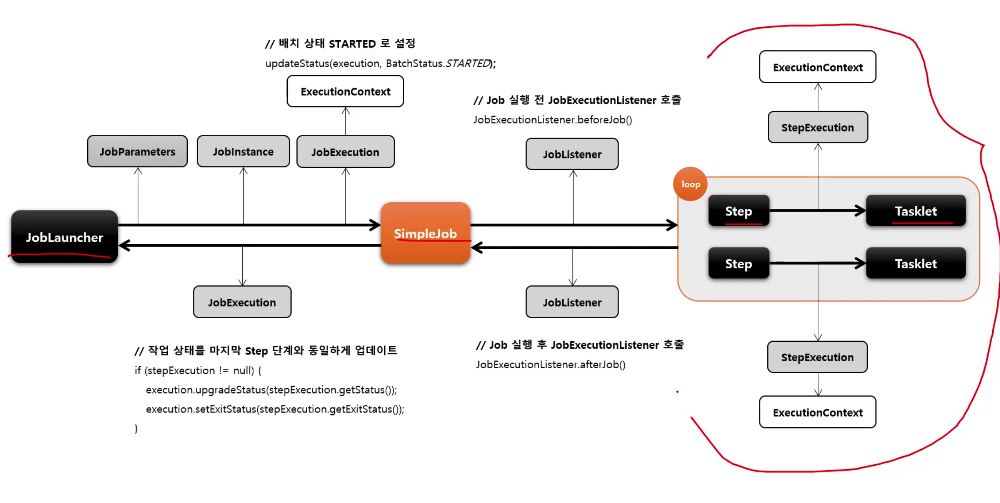
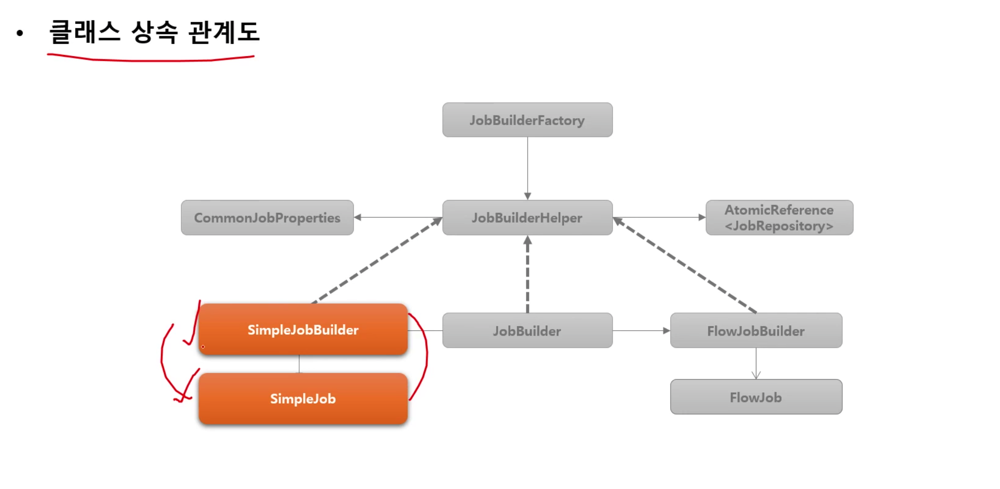

### StepBuilderFactory / StepBuilder

1. StepBuilderFactory
    - StepBuilder를 생성하는 팩토리 클래스로서 get(String name)메서드 제공
    - StepBuilderFactory.get("stepName") -> stepName으로 Step 생성

2. StepBuilder
    - Step 을 구성하는 설정 조건에 따라 다섯 개의 하위 빌더 클래스를 생성하고 실제 Step생성을 위임한다.
    - TaskletStepBuilder : TaskletStep을 생성하는 기본 빌더 클래스
    - SimpleStepBuilder : TaskletStep을 생성하며 내부적으로 청크기반의 작업을 처리하는 ChunkOrientedTasklet 클래스를 생성한다.
    - PartitionStepBuilder : PartitionStep을 생성하며 멀티 스레드 방식으로 Job을 실행한다.
    - JobStepBuilder : JobStep을 생성하며 Step 안에서 Job을 실행한다.
    - FlowStepBuilder : FlowStep을 생성하여 Step안에서 Flow를 실행한다.

### TaskletStep

1. 기본개념
    - 스프링 배치에서 제공하는 Step의 구현체로서 Tasklet을 실행시키는 도매인 객체
    - RepeatTemplate 를 사용해 Tasklet의 구문을 트랜잭션 경계 내에서 반복해서 실행
    - Task 기반과 Chunk 기반으로 나누어서 Tasklet을 실행함

2. Task vs Chunk
    - 스프링 배치에서 Step의 실행 단위는 크게 2가지로 나누어짐
    - Chunk 기반
        - 하나의 큰 덩어리를 n개씩 나눠서 실행한다 대량 처리를 하는 경우 효과적으로 설계
        - ItemReader, ItemProcessor, ItemWriter 를 사용하며 청크 기반 전용 Tasklet인 ChunkOrientedTasklet 구현체가 제공
    - Task 기반
        - ItemReader 와 ItemWriter와 같은 청크 기반의 작업 보다 단일 작업 기반으로 처리되는 것이 더 효율적인 경우
        - 주로 Tasklet 구현체를 만들어 사용
        - 대량 처리를 하는 경우 chunk 기반에 비해 더 복잡한 구현 필

```java
public Step bachStep(){
    return stepBuilderFactory.get("batchStep")
        .tasklet(Tasklet)
        .startLimit(10)
        .allowStartIfComplete(true)
        .listener(StepExecutionListener)
        .build();
}
```


### tasklet()
1. 기본 개념
    - Tasklet 타입의 클래스를 설정한다.
      - Tasklet
        - Step내에서 구성되고 실행되는 도메인 객체로서 주로 단일 태스크를 수행하기 위한 것
        - TaskletStep 에 의해 반복적으로 수행되며 반환값에 따라 계속 수행 혹은 종료한다.
        - RepeatStatus - Tasklet의 반복 여부 상태 값
          - RepeatStatus.FINISHED - Tasklet 종료 == null
          - RepeatStatus.CONTINUABLE - Tasklet 반복
    - 익명 클래스 혹은 구현 클래스를 만들어서 사용
    - 이 메소드를 실행하게 되면 TaskletStepBuilder가 반환되어 관련 API를 설정할 수 있다.
    - Step 에 오직 하나의 Tasklet 설정이 가능하며 두 개 이상을 설정 했을 경우 마지막에 설정한 객체가 실행된다

2. 구조
Tasklet

RepeatStatus execute(StepContribution, ChinkContext);


### startLimit() / 

1. 기본개념
    - Step의 실행 횟수를 조정할 수 있다.
    - Step 마다 설정할 수 있다.
    - 설정 값을 초과해서 다시 실행하려고 하면 StartLimitExceededException 발생
    - start-limit의 디폴트 값은 Integer.MAX_VALUE

### allowStartIfComplete()

1. 기본개념
   - 재시작 가능한 job에서 Step의 이전 성공 여부와 상관없이 항상 step을 실행하기 위한 설정
   - 실행마다 유혀성을 검증하는 Step이나 사전 작업이 꼭 필요한 Step 등
   - 기본적으로 COMPLETED 상태를 가진 Step은 Job 재 시작 시 실행하지 않고 스킵한다.
   - allow-start-if-complete가 "true"로 설정된 step은 항상 실행한다.


### JobStep

1. 기본 개념
    - Job에 속하는 Step 중 외부의 Job을 포함하고 있는 Step
    - 외부의 Job이 실패하면 해당 Step이 실패하므로 결국 최종 기본 job도 실패한다.
    - 모든 메타데이터는 기본 Job과 외부 Job별로 각각 저장된다.
    - 커다란 시스템을 작은 모듈로 쪼개고 job의 흐름을 관리하고자 할 떄 사용할 수 있다.

2. Api 소개

StepBuilderFactory > StepBuilder > JobStepBuilder > JobStep

```java
public Step jobStep(JobLauncher jobLauncher) {
    return stepBuilderFactory.get("jobStep") // StepBuilder 를 생성하는 팩토리, Step 이름을 매개변수로 받음
        .job(Job) // JobStep 내에서 실행될 Job 설정 JobStepBuilder 반환
        .launcher(jobLauncher) // Job을 실행할 JobLauncher 설정
        .parametersExtractor(JobParametersExtractor) // Step의 ExecutionContext를 Job이 실행되는 데 필요한 JobParameters로 반환
        .build();
}
```


### Job and Flow

### FlowJob

1. 기본개념
    - Step을 순차적으로만 구성하는 것이 아닌 특정한 상태에 따라 흐름을 전환하도록 구성할 수 있으며 FlowJobBuilder에 의해 생성된다.
      - Step이 실패 하더라도 Job은 실패로 끝나지 않도록 해야하는 경우
      - Step이 성공 했을 때 다음에 실행해야 할 Step을 구분해서 실행 해야 하는 경우
      - 특정 Step은 전혀 실행되지 않게 구성해야 하는 경우
    - Flow와 Job의 흐름을 구성하는데만 관여하고 실제 비즈니스 로직은 Step에서 이루어진다.
    - 내부적으로 SimpleFlow 객체를 포함하고 있으며 Job실행시 호출한다.

2. SimpleJob : 순차적 흐름, FlowJob : 조건적 흐름

JobBuilderFactory > JobBuilder > JobFlowBuilder > FlowBuilder > FlowJob

```java
public Job batchJob() {
    return jobBuilderFactory.get("batchJob") 
        .start(Step) // Flow 시작하는 Step 설정
        .on(String pattern) // Step의 실행 결과로 돌려받는 종료상태 (ExitStatus)를 캐치하여 매칭하는 패턴, TransitionBuilder 반환
        .to(Step)  // 다음으로 이동할 Step 지정
        .stop() / fail() / end() / stopAndRestart() // Flow를 중지 / 실패 / 종료 하도록 Flow 종료
        .from(Step) // 이전 단계에서 정의한 Step의 Flow를 추가적으로 정의함
        .next(Step) // 다음으로 이동할 Step 지정
        .end() // build() 앞에 위치하면 FlowBuilder를 종료하고 SimpleFlow 객체 생성
        .build() // FlowJob 생성하고 flow 필드에 SimpleFlow 저장
}
```

### start() / next()

```java
return jobBuilderFactory.get("batchJob")
        .start(Flow) // 처음 실행 할 Flow 설정, JobFlowBuilder 가 반환된다. 여기에 Step 이 인자로 오게 되면 SimpleJobBuilder가 반환
        .next(Step or Flow or JobExecutionDecider)
        .on(String pattern)
        .to(Step)
        .stop() / fail() / end() / stopAndRestart()
        .end()
        .build();
```


### Transition - 배치 상태 유형 (BatchStatus, ExitStatus, FlowExecutionStatus)

- BatchStatus
  - JobExecution과 StepExecution의 속성으로 Job과 Step의 종료 후 최종 결과 상태가 무엇인지 정의
  - SimpleJob
    - 마지막 Step의 BatchStatus 값을 Job의 최종 BatchStatus 값으로 반영
    - Step이 실패할 경우 해당 Step이 마지막 Step이 된다.
  - FlowJob
    - Flow 내 Step의 ExitStatus 값을 FlowExecutionStatus 값으로 저장
    - 마지막 Flow의 FlowExecutionStatus 값을 Job의 최종 BatchStatus값으로 반영
- COMPLETED, STARTING, STARTED, STOPPING, STOPPED, FAILED, ABANDONED, UNKNOWN
- ABANDONED는 처리를 완료했지만 성공하지 못한 단계와 재시작시 건너 뛰어야하는 단계


- ExitStatus
  - JobExecution과 StepExecution의 속성으로 Job과 Step의 실행 후 어떤 상태로 종료되었는지 정의
  - 기본적으로 ExitStatus는 BatchStatus와 동일한 값으로 설정된다.
  - SimpleJob
    - 마지막 Step의 ExitStatus값을 Job의 최종 ExitStatus 값으로 반영
  - FlowJob
    - Flow 내 Step의 ExitStatus 값을 FlowExecutionStatus 값으로 저장
    - 마지막 Flow 의 FlowExecutionStatus 값을 Job의 최종 ExitStatus 값으로 반영
  - UNKNOWN, EXECUTING, COMPLETED, NOOP, FAILED, STOPPED
  - exitCode 속성으로 참조


- FlowExecutionStatus 
  - FlowExecution의 속성으로 Flow의 실행 후 최종 결과 상태가 무엇인지 정의
  - Flow내 Step이 실행되고 나서 ExitStatus 값을 FlowExecutionStatus 값으로 저장
  - FlowJob의 배치 결과 상태에 관여함
  - COMPLETED, STOPPED, FAILED, UNKNOWN


### Transition

```java
public Job batchJob() {
    return jobBuilderFactory.get("batchJob")
        .start(Flow)
        .next(Step of Flow of JobExecutionDecider)
        .on(String pattern) // TransitionBuilder 반환
        .to(Step or Flow or JobExecutionDecider)
        .stop() / fail()/ end()/ stopAndRestart(Step or Flow or JobExecutionDecider)
        .end()
        .build();
}
```

1. 기본 개념
   - Transition
     - Flow 내 Step의 조건부 전환을 정의함
     - Job의 API 설정에서 on(String pattern) 메소드를 호출하면 TransitionBuilder가 반환되어 Transition Flow를 구성할 수 있음
     - Step의 종료상태(ExitStatus)가 어떤 pattern과도 매칭되지 않으면 스프링 배치에서 예외를 발생하고 Job은 실패
     - transition은 구체적인 것부터 그렇지 않은 순서로 적용된다.
2. API
    - on(String pattern)
      - Step의 실행 결과로 돌려받는 종료상태(ExitStatus)와 매칭하는 패턴 스키마, BatchStatus와 매칭하는 것이 아님
      - pattern과 ExitStatus와 매칭이 되면 다음으로 실행할 Step을 지정할 수 있다.
      - 특수문자는 두 가지만 허용
        - "*" : 0개 이상의 문자와 매칭, 모든 것에서는 이미 정의 된 것은 제외
        - "?" : 정확히 1개의 문자와 매칭
    - to()
      - 다음으로 실행할 단계를 지정
      - from()
        - 이전 단계에서 정의한 Transition을 새롭게 추가 정의함

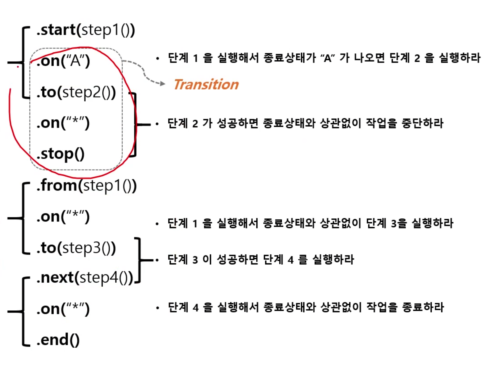


### 사용자 정의 ExitStatus

1. 기본 개념
    - ExitStatus에 존재하지 않는 exitCode를 새롭게 정의해서 설정
    - StepExecutionListener의 afterStep() 메서드에서 Custom exitCode 생성 후 새로운 ExitStatus 반환
    - Step 실행 후 완료 시점에서 현재 exitCode를 사용자 정의 exitCode로 수정할 수 있음


### JobExecutionDecider

1. 기본 개념
    - ExitStatus를 조작하거나 StepExecutionListener를 등록할 필요 없이 Transition 처리를 위한 전용 클래스
    - Step과 Transition 역할을 명확히 분리해서 설정 할 수 있음
    - Step의 ExitStatus 가 아닌 JobExecutionDecider 의 FlowExecutionStatus 상태값을 새롭게 설정해서 반환함


### FlowJob 아키텍처

### SimpleFlow
개념 및 API 소개

1. 기본개념
    - 스프링 배치에서 제공하는 Flow 의 구현체로서 각 요소(Step, Flow, JobExecutionDecider) 들을 담고 있는 state를 실행시키는 도메인 객체
    - FlowBuilder를 사용해서 생성하며 Transition 과 조합하여 여러 개의 Flow 및 중첩 Flow 를 만들어 Job을 구성할 수 있다.


StateTransition
State state // 현재 state
String pattern // on() Transition
String next // 다음 State


### FlowStep

1. 기본개념
    - Step 내에 Flow 를 할당하여 실행시키는 도메인 객체
    - flowStep 의 BatchStatus 와 ExitStatus는 Flow 의 최종 상태값에 따라 결정된다.

2. API 소개

StepBuilderFactory > StepBuilder > FlowStepBuilder > FlowStep

```java
public Step flowStep() {
    return stepBuilderFactory.get("flowStep")
        .flow(flow())
        .build();
}
```


### JobScope, StepScope

1. Scope
    - 스프링 컨테이너에서 빈이 관리되는 범위
    - singleton, prototype, request, session, application 있으며 기본은 singleton으로 생성됨
2. 스프링 배치 스코프
    - @JobScope, @StepScope
      - Job과 Step의 빈 생성과 실행에 관여하는 스코프
      - 프록시 모드를 기본값으로 하는 스코프
      - 해당 스코프가 선언되면 빈이 생성이 어플리케이션 구동시점이 아닌 빈의 실행시점에 이루어진다.
        - @Values를 주입해서 빈의 실행 시점에 값을 참조할 수 있으며 일종의 Lazy Binding이 가능해 진다.
        - @Value("#{jobParameters[parameter]}"), @Value("#{jobExecutionContext[parameter]}"), @Value("#{stepExecutionContext[parameter]}")
        - @Values를 사용할 경우 빈 선언문에 @JobScope, @StepScope를 정의하지 않으면 오류를 발생하므로 반드시 선언해야함
      - 프록시 모드로 빈이 선언되기 때문에 어플리케이션 구동시점에는 빈의 프록시 객체가 생성되어 실행 시점에 실제 빈을 호출해 준다.
      - 병렬처리 시 각 스레드 마다 생성된 스코프 빈이 할당되기 때문에 스레드에 안전하게 실행이 가능하다

3. @JobScope
   - Step 선언문에 정의한다.
   - @Value: jobParamter, jobExecutionContext만 사용가능

4. @StepScope
    - Tasklet이나 ItemReader, ItemWriter, ItemProcessor 선언문에 정의한다.
    - @Value: jobParameter, jobExecutionContext, stepExecutionContext 사용가능


1. Proxy 객체 생성
    - @JobScope, @StepScope 어노테이션이 붙은 빈 선언은 내부적으로 빈의 Proxy 객체가 생성된다.
      - @JobScope
        - @Scope(value = "job", proxyMode = ScopedProxyMode.TARGET_CLASS)
      - @StepScope
          - @Scope(value = "step", proxyMode = ScopedProxyMode.TARGET_CLASS)

2. JobScope, StepScope
    - Proxy 객체의 실제 대상이 되는 Bean을 등록, 해제하는 역할
    - 실제 빈을 저장하고 있는 JobContext, StepContext를 가지고 있다.

3. JobContext, StepContext
    - 스프링 컨테이너에서 생성된 빈을 저장하는 컨텍스트 역할 
    - Job의 실행 시점에서 프록시 객체가 실제 빈을 참조할 때 사용됨


### 스프링 배치 청크 프로세스

1. Chunk
2. ChunkOrientedTasklet
3. ItemReader / ItemWriter / ItemProcessor
4. ItemStream
5. 아키텍처

### Chunk
1. 기본개념
    - Chunk란 여러 개의 아이템을 묶은 하나의 덩어리, 블록을 의미
    - 한 번에 하나씩 아이템을 입력 받아 Chunk 단위의 덩어리로 만든 후 Chunk단위로 트랜잭션을 처리함, 즉 Chunk 단위의 Commit과 Rollback 이 이루어짐
    - 일반적으로 대용량 데이터를 한 번에 처리하는 것이 아닌 청크 단위로 쪼개어서 더 이상 처리할 데이터가 없을 때까지 반복해서 입출력하는데 사용됨


2. Chunk<I> vs Chunk<O>
    - Chunk<I> 는 ItemReader로 읽은 하나의 아이템을 Chunk에서 정한 개수만큼 반복해서 저장하는 타입
    - Chunk<O> 는 ItemReader로부터 전달받은 Chunk<I>를 참조해서 ItemProcessor에서 적절하게 가공, 필터링한 다음 ItemWriter에 전달하는 타입


```java
Chunk

List items
List<SkipWrapper> skips
List<Exception> errors
ChunkIterator iterator(return new ChunkIterator(items))

```

### ChunkOrientedTasklet

- 기본개념
    - ChunkOrientedTasklet은 스프링 배치에서 제공하는 Tasklet의 구현체로서 Chunk 지향 프로세싱을 담당하는 도메인 객체
    - ItemReader, ItemWriter, ItemProcessor를 사용해 Chunk 기반의 데이터 입출려 처리를 담당한다.
    - TaskletStep에 의해서 반복적으로 실행되며 ChunkOrientedTasklet이 실행 될 때마다 매번 새로운 트랜잭션이 생성되어 처리가 이루어진다.
    - exception이 발생할 경우 해당 Chunk는 롤백 되며 이전에 커밋한 Chunk는 완료된 상태가 유지된다.
    - 내부적으로 ItemReader를 핸들링 하는 ChunkProvider와 ItemProcessor, ItemWriter를 핸들링하는 ChunkProcessor 타입의 구현체를 가진다.


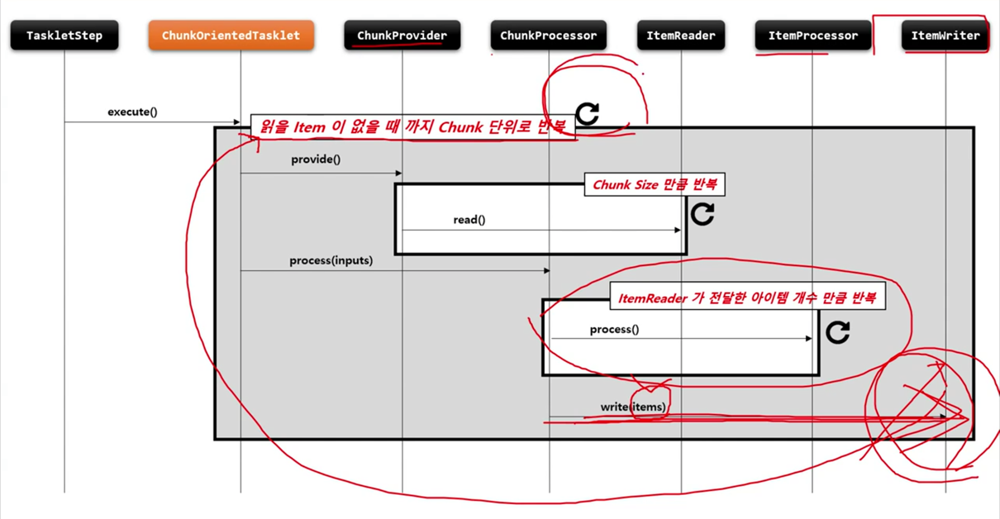


```java

public Step chunkStep() {
    return stepBuilderFactory.get("chunkStep") 
        .<I, O>chunk(10) // chunk size 설정, chunk size 는 commit inverval을 의미함
        .<I, O>chunk(CompletionPolicy) // Chunk 프로세스를 완료하기 위한 정책 설정 클래스 지정
        .reader(itemReader()) // 소스로 부터 item을 읽거나 가져오는 ItemReader 구현체 설정
        .writer(itemWriter()) //item을 목적지에 쓰거나 보내기 위한 ItemWriter 구현체 설정
        .processor(itemProcessor()) // item을 변형, 가공, 필터링 하기 위한 ItemProcessor 구현체 설정
        .stream(ItemStream()) // 재시작 데이터를 관리하는 콜백에 대한 스트림 등록
        .readerlsTransactionalQueue() // Item이 JMS, Message Queue Server와 같은 트랜잭션 외부에서 읽혀지고 캐시할 것인지 여부, 기본값은 false
        .listener(ChunkListener) // Chunk 프로레스가 진행되는 특정 시점에 콜백 제공받도록 ChunkListener 설정
        .build();
}

```


#### ChunkProvider
1. 기본개념
    - ItemReader를 사용해서 소스로부터 아이템을 Chunk size 만큼 읽어서 Chunk단위로 만들어 제공하는 도메인 객체
    - Chunk<I> 를 만들고 내부적으로 반복문을 사용해서 ItemReader.read() 를 계속 호출하면서 item을 Chunk에 쌓는다.
    - 외부로부터 ChunkProvider가 호출될 때마다 항상 새로운 Chunk가 생성된다.
    - 반복문 종료 시점
      - Chunk Size만큼 item을 읽으면 반복문 종료되고 ChunkProcessor로 넘어감
      - ItemReader가 읽은 item이 null일 경우 반복문 종료 및 해당 Step 반복문까지 종료
    - 기본 구현체로서 SimpleChunkProvider와 FaultTolerantChunkProvider가 있다.


#### ChunkProcessor
1. 기본개념
    - ItemProcessor를 사용해서 Item을 변형, 가공, 필터링하고 ItemWriter를 사용해서 Chunk데이터를 저장 출력한다.
    - Chunk<O>를 만들고 앞에서 넘어온 Chunk<I>의 item을 한 건씩 처리한 후 Chunk<O>에 저장한다.
    - 외부로 부터 ChunkProcessor가 호출될 때마다 항상 새로운 Chunk가 생성된다.
    - ItemProcessor는 설정시 선택사항으로서 만약 객체가 존재하지 않을 경우 ItemReader에서 읽은 item그대로가 Chunk<O>에 저장된다.
    - ItemProcessor처리가 완료되면 Chunk<O>에 있는 List<Item>을 ItemWriter에게 전달한다.
    - ItemWriter는 chunk size만큼 데이터를 commit처리 하기 때문에 chunk size는 공 commit interval 이 된다.
    - 기본 구현체로서 SimpleChunkProcessor와 FaultTolerantChunkProcessor가 있다.


### ItemReader
- 기본 개념
  - 다양한 입력으로부터 데이터를 읽어서 제공하는 인터페이스
    - 플랫 파일 - csv, txt 고정 위치로 정의된 데이터 필드나 특수문자로 구별된 데이터의 행
    - XML, json
    - Database
    - JMS, RabbitMQ와 같은 Message Queuing 서비스
    - Custom Reader - 구현 시 멀티 스레트 환경에서 스레드에 안전하게 구현할 필요가 있음
  - ChunkOrientedTasklet 실행 시 필수적 요소로 설정해야 

- T read()
    - 입력 데이터를 읽고 다음 데이터로 이도한다.
    - 아이템 하나를 리턴하며 더 이상 아이템이 없는 경우 null 리턴
    - 아이템 하나는 파일의 한줄, DB의 한 row 혹은 XML 파일에서 하나의 엘리먼트가 될 수 있다.
    - 더 이상 처리해야 할 item이 없어도 예외가 발생하지 않고 ItemProcessor와 같은 다음 단계로 넘어 간다.

File (FlatFileItemReader, StaxEventItemReader, JsonItemReader, MultiResourceItemReader)
DB (JdbcCursorItemReader, JpaCursorItemReader, JdbcPagingItemReader, JpaPagingItemReader, ItemReaderAdapter)
Custom (SynchronizedItemStreamReader, CustomItemReader)


ItemWriter
- 기본 개념
  - Chunk 단위로 데이터를 받아 일괄 출력 작업을 위한 인터페이스
  - 아이템 하나가 아닌 아이템 리스트를 전달 받는다.
  - ChunkOrientedTasklet 실행 시 필수적 요소로 설정해야 한다.

- void write(List<? extends T> items)
  - 출력 데이터를 아이템 리스트로 받아 처리한다.
  - 출력이 완료되고 트랜잭션이 종료되면 새로운 Chunk 단위 프로세스로 이동한다.


ItemProcessor
- 기본 개념
  - 데이터를 출력하기 전에 데이터를 가공, 변형, 필터링하는 역할
  - ItemReader 및 ItemWriter와 분리되어 비즈니스 로직을 구현할 수 있다.
  - ItemReader로 부터 받은 아이템을 특정 타입으로 변환해서 ItemWriter에 넘겨 줄 수 있다.
  - ItemReader로 부터 받은 아이템들 중 필터과정을 거쳐 원하는 아이템들만 ItemWriter에게 넘겨줄 수 있따.
    - ItemProcessor 에서 process() 실행결과 null을 반환하면 Chunk<O> 에 저장되지 않기 때문에 결국 ItemWriter에 전달되지 않는다.
  - ChunkOrientedTasklet 실행 시 선택적 요소이기 때운에 청크 기반 프로세싱에서 ItemProcessor 단계가 반드시 필요한 것은 아니다.


### ItemStream
- 기본 개념
  - ItemReader와 ItemWriter 처리 과정 중 상태를 저장하고 오류가 발생하면 해당 상태를 참조하여 실패한 곳에서 재 시작 하도록 지원
  - 리소스를 열고(open) 닫아야(close) 하며 입출력 장치 초기화 등의 작업을 해야 하는 경우
  - ExecutionContext 를 매개변수로 받아서 상태 정보를 업데이트(update) 한다.
  - ItemReader 및 ItemWriter는 ItemStream을 구현해야 한다.

ItemStream
void open // read, write 메서드 호출전에 파일이나 커넥션이 필요한 리소스에 접근하도록 초기화 작업
void update // 현재까지 진행된 모든 상태를 저장
void close // 열려 있는 모든 리소스를 안전하게 처리하고 닫음

reader 전후 open update , writer 전후 open update 끝나고 close 호출


### Chunk Process 아키텍처

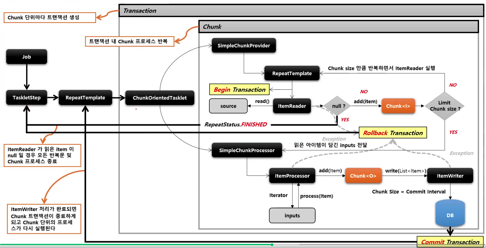


#### FlatFileItemReader

- 기본개념
  - 2차원 데이터(표)로 표현된 유형의 파일을 처리하는 ItemReader
  - 일반적으로 고정 위치로 정의된 데이터 필드나 특수 문자에 의해 구별된 데이터의 행을 읽는다.
  - Resource와 LineMapper 두 가지 요소가 필요하다.  (6글자 / 6글자 / 4글자)


- Resource
  - FileSystemResource - new FileSystemResource("resource/path/config.xml")
  - ClassPathResource - new ClassPathResource("resource/path/config.xml")

- LineMapper
  - 파일의 라인 한줄을 Object로 변환해서 FlatBileItemReader로 리턴
  - 단순히 문자열을 받기 때문에 문자열을 토큰화해서 객체로 매핑하는 과정이 필요
  - LineTokenizer 와 FieldSetMapper를 사용해서 처리한다
  - FieldSet
    - 라인을 필드로 구분해서 만든 배열 토큰을 전달하면 토큰 필드를 참조 할 수 있도록 한다.
    - JDBC의 ResultSet과 유사
  - LineTokenizer
    - 입력받은 라인을 FieldSet으로 변환해서 리턴한다.
    - 파일마다 형식이 다르기 때문에 문자열을 FieldSet으로 변환하는 작업을 추상화해야한다.
  - FieldSetMapper
    - FieldSet객체를 받아서 원하는 객체로 매핑해서 리턴한다.
    - jdbcTemplate의 RowMapper와 동일한 패턴을 사용한다.

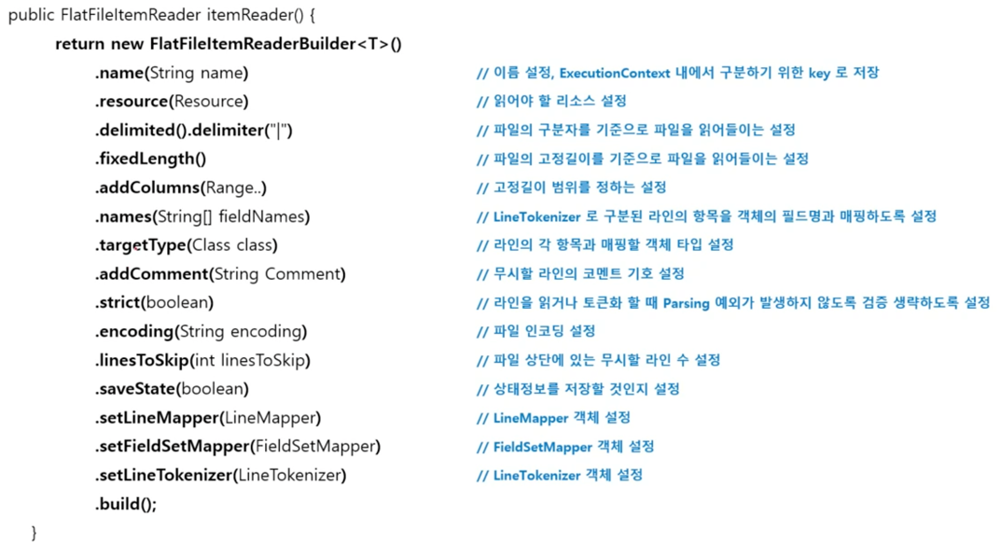


#### DelimitedLineTokenizer

- 기본개념
  - 한 개 라인의 String을 구분자 기준으로 나누어 토큰화 하는 방식

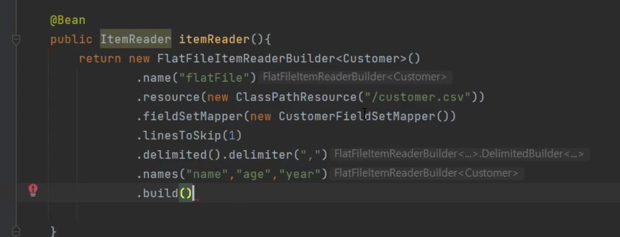

fieldSetMapper(BeanWrapperFiledSetMapper<>())
사용하고
targetType(Customer.class) 해도 잘 작용


#### FixedLengthTokenizer

- 기본 개념
  - 한 개 라인의 String을 사용자가 설정한 고정길이 기준으로 나누어 토큰화 하는 방식
  - 범위는 문자열 형식으로 설정 할 수 있다.
    - 1-4 또는 


#### tokenizer Exception Handling

- 기본 개념
  - 라인을 읽거나 토큰화 할 때 발생하는 Parsing 예외를 처리할 수 있도록 예외 계층 제공
  - 토큰화 검증을 엄격하게 적용하지 않도록 설정하면 Parsing 예외가 발생하지 않도록 할 수 있다.

IncorrectTokenCountException e, IncorrectLineLengthException ex


#### StaxEventItemReader - 개념 및 API 소개

- JAVA XML API
  - DOM 방식
    - 문서 전체를 메모리에 로드한 후 Tree 형태로 만들어서 데이터를 처리하는 방식, pull 방식
    - 엘리멘트 제어는 유연하나 문서크기가 클 경우 메모리 사용이 많고 속도가 느림
  - SAX 방식
    - 문서의 항복을 읽을 때 마다 이벤트가 발생하여 데이터를 처리하는 push 방식
    - 메모리 비용이 적고 속도가 빠른 장점은 있으나 엘리멘트 제어가 어려움
  - StAX 방식 (Streaming API for XML)
    - DOM과 SAX의 장점과 단점을 보완한 API 모델로서 push 와 pull을 동시에 제공함
    - XML 문서를 읽고 쓸 수 있는 양방향 파서기 지원
    - XML 파일의 항목에서 항목으로 직접 이동하면서 Stax파서기를 통해 구문 분석
    - 유형
      - Iterator API 방식
        - XMLEventReader의 nextEvent()를 호출해서 이벤트 객체를 가지고 옴
        - 이벤트 객체는 XML 태그 유형에 대한 정보를 제공함
      - Cursor API 방식
        - JDBC Resultset처럼 작동하는 API로서 XMLStreamReader는 XML 문서의 다음 요소로 커서를 이동한다.
        - 커서에서 직접 메서드를 호출하여 현재 이벤트에 대한 자세한 정보를 얻는다.

- Spring-OXM
  - 스프링의 Object XML Mapping 기술로 XML 바인딩 기술을 추상화함
    - Marshaller
      - marshall - 객체를 XML로 직렬화하는 행위
    - Unmarshaller
      - unmarshall - XML을 객체로 역직렬화하는 행위
    - Marshaller와 Unmarshaller 바인딩 기능을 제공하는 오픈소스
- Spring Batch XML
  - 스프링 배치에서는 StAX 방식으로 XML 문서를 처리하는 StaxEventItemReader를 제공
  - XML 을 읽어 자바 객체로 매핑 자바 객체를 XML로 쓸 수 있는 트랜잭션 구조 지원


### JsonItemReader
- 기본 개념
  - Json 데이터의 Parsing과 Binding을 JsonObjectRedader 인터페이스 구현체에 위임하여 처리하는 ItemReader
  - 두 가지 구현체 제공
    - JacksonJsonObjectReader
    - GsonJsonObjectReader


### Cursor & Paging

- 기본 개념
  - 배치 어플리케이션은 실시간적 처리가 어려운 대용량 데이터를 다루며 이 때 DB I/O의 성눙문제와 메모리 자원의 효율성 문제를 해결할 수 있어야한다.
  - 스프링 배치에서는 대용량 데이터 처리를 위한 두가지 해결방안을 제시

- Cursor Based
  - JDBC ResultSet의 기본 메커니즘을 사용
  - 현재 행에 커서를 유지하며 다음 데이터를 호출하면 다음 행으로 커서를 이동하며 데이터 반환이 이루어지는 Streaming 방식의 I/O 이다
  - ResultSet이 Open 될 때마다 next() 메소드가 호출 되어 Database의 데이터가 반환되고 객체와 매핑이 이루어진다.
  - DB Connection이 연결되면 배치 처리가 완료될 때 까지 데이터를 읽어오기 때문에 DB와 SocketTimeout을 충분히 큰 값으로 설정 필요
  - 모든 결과를 메모리에 할당하기 때문에 메모리 사용량이 많아지는 단점이 있다.
  - Connection 연결 유지 시간과 메모리 공간이 충분하다면 대량의 데이터 처리에 적합할 수 있다. (fetchSize 조절)

- Paging Based 처리
  - 페이징 단위로 데이터를 조회하는 방식으로 Page Size 만큼 한 번에 메모리로 가지고 온 다음 한 개씩 읽는다.
  - 한 페이지를 읽을때마다 Connection을 맺고 끊기 대문에 대량의 데이터를 처리하더라도 SocketTimeout 예외가 거의 일어나지 않는다.
  - 시작 행 번호를 지정하고 페이지에 반환시키고자 하는 행의 수를 지정한 후 사용 - Offset, Limit
  - 페이징 단위의 결과만 메모리에 할당하기 때문에 메모리 사용량이 적어지는 장점이 있다
  - Connection 연결 유지 시간이 길지 않고 메모리 공간을 효율적으로 사용해야 하는 데이터 처리에 적합할 수 있다.


### JdbcCursorItemReader
- 기본개념
  - Cursor 기반의 JDBC 구현체로서 ResultSet과 함께 사용되며 Datasource에서 Connection을 얻어서와서 SQL 실행한다
  - Thread 안정성을 보장하지 않기 때문에 멀티 스레드 환경에서 사용할 경우 동시성 이유사 발생하지 않도록 별도 동기화 처리가 필요하다

- API
```java
public JdbcCursorItemReader itemReader() {
    return new JdbcCursorItemReaderBuilder<T>()
        .name("cursorItemReader") 
        .fetchSize(int chunkSize) // Cursor 방식으로 데이터를 가지고 올 때 한 번에 메모리에 할당할 크기를 설정한다.
        .dataSource(DataSource) // DB에 접근하기 위해 Datasource 설정
        .rowMapper(RowMapper) // 쿼리 결과로 반환되는 데이터와 객체를 매핑하기 위한 RowMapper
        .beanRowMapper(Class <T>) // 별도의 RowMapper을 설정하지 않고 클래스 타입을 설정하면 자동으로 객체와 매ㅣㅇ
        .sql(String sql) // ItemReader가 조회 할 때 사용할 쿼리 문장 설정
        .queryArguments(Object... args) //쿼리 파라미터 설정
        .maxItemCount(int count) // 조회 할 최대 item 수
        .currentItemCount(int count) // 조회 Item의 시작 지점
        .maxRows(int maxRows) // ResultSet 오브젝트가 포함 할 수 있는 최대 행 수
        .build()
}
```


### JpaCursorItemReader
- 기본 개념
  - Spring Batch 4.3버전부터 지원함
  - Cursor 기반의 JPA 구현체로서 EntityManagerFactory 객체가 필요하며 쿼리는 JPQL을 사용한다.

- API
```java
public JpaCursorItemReader itemReader() {
    return new JpaCursorItemReaderBuilder<T>()
        .name("cursorItemReader")
        .queryString("String JPQL")
        .EntityManagerFactory(EntityManagerFactory)
        .parameterValue(Map<String, Object> parameters)
        .maxItemCount(int count)
        .currentItemCount(int count) // 조회 item 시작 지점
        .build();
}
```

### JdbcPagingItemReader

- 기본개념
  - Paging기반의 JDBC 구현체로서 쿼리에 시작 행 번호와 페이지에서 반환 할 수 행 수를 지정해야 SQL을 실행한다.
  - 스프링 배치에서 offset과 limit을 PageSize에 맞게 자동으로 생성해 주며 페이징 단위로 데이터를 조회할 때 마다 새로운 쿼리가 실행한다.
  - 페이지마다 새로운 쿼리를 실행하기 때문에 페이징 시 결과 데이터의 순서가 보장될 수 있도록 order by 구문이 작성되도록 한다.
  - 멀티 스레드 환경에서 Thread안정성을 보장하기 때문에 별도의 동기화를 할 필요가 없다.

- PagingQueryProvider
  - 쿼리 실행에 필요한 쿼리문을 ItemReader에게 제공하는 클래스
  - 데이터베이스마다 페이징 전략이 다르기 때문에 각 데이터 베이스 유형마다 다른 PagingQueryProvider를 사용한다.
  - select 절, from 절, sortKey는 필수로 설정해야 하며 where, group by 절은 필수가 아니다.

```java
public JdbcPagingItemReader itemReader() {
        .name("pagingItemReader")
        .pageSize(int pageSize)
        .dataSource(DataSource)
        .queryProvider(PagingQueryProvider) // queryProvider new SqlPagingQueryProviderFactoryBean();
        .rowMapper(Class<T>)
        .selectClause(String selectClause)
        .whereClause(String whereClause)
        .groupClause(String groupClause)
        .sortKeys(Map<String, Object> parameters)
        .maxItemCount(int count)
        .currentItemCount(int count)
        .maxRows(int maxRows)
        .build();
}

```


```java
@Bean
public ItemReader<? xtends Customer> customerItemReader() {
     return new JpaPagingItemReaderBuilder<Customer>(
        .name("jpaPagingItemReader")
        .entityManagerFactory(entityManagerFactory)
        .pageSize(10)
        .queryString("select c from Customer c join fetch c.address")
        .build();
    )
}
```


### ItemReaderAdapter

- 기본개념
  - 배치 Job 안에서 이미 있는 DAO나 다른 서비스를 ITemReader 안에서 사용하고자 할 때 위임 역할을 한다


### ItemWriter

- Flat Files - FlatFileItemWriter
- XML - StaxEventItemWriter
- Json - JsonFileItemWriter
- DB - JDBC ItemWriter, JPA ItemWriter

#### FlatFileItemWriter
- 기본개념
  - 2차원 데이터로 표현된 유형의 파일을 처리하는 ItemWriter
  - 고정 위치로 정의된 데이터 필드나 특수 문자에 의해 구별된 데이터의 행을 기록한다.
  - Resource와 LineAggregator 두 가지 요소가 필요하다

- 구조

```java
String encoding = DEFAULT_CHARSET // 문자열 인코딩, 디폴트는 Charset.defaultCharset()

boolean append = false // 대상 파일이 이미있는 경우 데이터를 계속 추가할 것인지 여부

Resource resource // 작성해야 할 리소스

LineAggregator<T> lineAggregator // Object를 String로 변환한다.

FlatFileHeaderCallback headerCallback // 헤더를 파일에 쓰기위한 콜팩 인터페이스

FlatFileFooterCallback footerCallback // 푸터를 파일에 쓰기위한 콜백 인터페이스
```


- LineAggregator
  - Item을 받아서 String으로 변환하여 리턴한다.
  - FieldExtractor를 사용해서 처리할 수 있다.
  - 구현체
    - PassThroughLineAggregator, DelimitedLineAggregator, FormatterLineAggregator

- FieldExtractor
  - 전달 받은 Item 객체의 필드를 배열로 만들고 배열을 합쳐서 문자열을 만들어 구현하도록 제공하는 인터페이스


### DelimitedLineAggregator
- 객체의 필드 사이에 구분자를 삽입해서 한 문자열로 변환한다.


### StaxEventItemWriter

- 기본개념
  - XML 쓰는 과정은 읽기 과정에 대칭적
  - StaxEventItemWriter는 Resource, marshaller, rootTagName가 필요하다.

```java
public StaxEventItemReader itemReader() {
    return new StaxEventItemWriterBuilder<T>()
        .name(String name)
        .resource(Rssource)
        .rootTagName()
        .overwriteOutput(boolean)
        .headerCallback()
        .footerCallback()
        .build();
}
```

### JsonFileItemWriter
- 기본개념
  - 객체를 받아 JSON String으로 변환하는 역할을 한다


### JdbcBatchItemWriter

- 기본 개념
  - JdbcCursorItemReader 설정과 마찬가지로 datasource를 지정하고, sql 속성에 실행할 쿼리를 설정
  - JDBC의 Batch 기능을 사용하여 bulk insert/update/delete 방식으로 처리
  - 단건 처리가 아닌 일괄처리이기 때문에 성능에 이점을 가진다.

- API
```java
public JdbcBatchItemWriter itemWriter() {
    return new JdbcBatchItemWriterBuilder<T>()
        .name(String name)
        .datasource(Datasource)
        .sql(String sql)
        .assertUpdates(boolean)
        .beanMapped()
        .columnMapped()
        .build();
}
```


### JpaItemWriter
- 기본 개념
  - JPA Entity기반으로 데이터를 처리하며 EntityManagerFactory를 주입받아 사용한다.
  - Entity를 하나씩 chunk 크기 만큼 insert 혹은 merge 한 다음 flush한다.
  - ItemReader 나 ItemProcessor 로 부터 아이템을 전달 받을 때는 Entity 클래스 타입으로 받아야 한다.

- API
```java
public JpaItemWriter itemWriter() {
    return new JpaItemWriterBuilder<T>()
        .usePersist(boolean)
        .entityManagerFactory(EntityManagerFactory)
        .build();
}
```


### ItemWriterAdapter

- 기본개념
  - 배치 Job 안에서 이미 있는 DAO나 다른 서비스를 ItemWriter안에서 사용하고자 할 때 위임 역할을 한다.


### ItemProcessor

#### CompositeItemProcessor

- 기본개념
  - ItemProcessor들을 연결(Chaining)해서 위임하면 각 ItemProcessor를 실행시킨다.
  - 이전 ItemProcessor 반환 값은 다음 ItemProcessor 값으로 연결된다.

- API
```java
public ItemProcessor itemProcessor() {
    return new CompositeItemProcessorBuilder<>()
        .delegates(ItemProcessor<?,?>... delegates)
        .build();
}

```


#### ClassifierCompositeItemProcessor
- 기본개념
  - Classifier로 라우팅 패턴을 구현해서 ItemProcessor 구현체 중에서 하나를 호출하는 역할을 한다.

- API
```java
public ItemProcessor itemProcessor() {
    return new ClassifierCompositeItemProcessorBuilder<>()
        .classifier(Classifier)
        .build();
}
```

### 스프링 배치 반복 및 오류 제어

1. Repeat
2. FaultTolerant 내결합성
3. Skip
4. Retry
5. Skip & Retry 아키텍처


#### Repeat
- 기본개념
  - Spring Batch는 얼마나 작업을 반복해야 하는지 알려 줄 수 있는 기능을 제공한다.
  - 특정 조건이 충족 될 때까지 Job 또는 Step을 반복하도록 배치 애플리케이션을 구성 할 수 있다.
  - 스프링 배치에서는 Step의 반복과 Chunk 반복을 RepeatOperation을 사용해서 처리하고 있다.
  - 기본 구현체로 RepeatTemplate를 제공한다.

- 반복을 종료할 것인지 여부를 결정하는 세가지 항목
  - RepeatStatus
    - 스프링 배치의 처리가 끝났는지 판별하기 위한 열거형
      - CONTINUABLE
      - FINISHED
  - CompletionPolicy
    - RepeatTemplate의 iterate 메소드 안에서 반복을 중단할지 결정
    - 실행 횟수 도는 완료시기, 오류 발생시 수행 할 작업에 대한 반복여부 결정
    - 정상 종료를 알리는데 사용
  - ExceptionHandler
    - RepeatCallback 안에서 예외가 발생하면 RepeatTemplate 가 ExceptionHandler 를 참조해서 예외를 다시 던질지 여부 결정
    - 예외를 받아서 다시 던지게 되면 반복 종료
    - 비정상 종료를 알리는데 사용된다.


### FaultTolerant

- 기본 개념
  - 스프링 배치는 Job실행 중에 오류가 발생할 경우 장애를 처리하기 위한 기능을 제공하여 이를 통해 복원력을 향상시킬 수 있다.
  - 오류가 발생해도 Step이 즉시 종료되지 않고 Retry 혹은 Skip 기능을 활성화 함으로써 내결함성 서비스가 가능하도록 한다.
  - 프로그램의 내결함성을 위한 Skip과 Retry 기능을 제공한다.
  
    - Skip
      - ItemReader / ItemProcessor / ItemWriter 에 적용 할 수 있다.
    - Retry
      - ItemProcessor / ItemWriter에 적용할 수 있다.
  - FaultTolerant 구조는 청크 기반의 프로세스 기반위에 Skip과 Retry 기능이 추가되어 재정의 되어 있다.

```java
public Step batchStep() {
    return new stepBuilderFactory.get("batchStep")
        .<I, O>chunk(10)
        .reader(ItemReader)
        .writer(ItemWriter)
        .faultTolerant()
        .skip(Class<? extends Throwable> type)
        .skipLimit(int skipLimit)
        .skipPolicy(SkipPolicy skipPolicy)
        .boSkip()
        .retry()
        .retryLimit()
        .retryPolicy()
        .backOffPolicy()
        .noRetry()
        .noRollback()
        .build();
}
```


#### Skip

- Skip은 데이터를 처리하는 동안 설정된 Exception이 발생했을 경우, 해당 데이터 처리를 건너뛰는 기능이다.
- 데이터의 사소한 오류에 대해 Step의 실패처리 대신 Skip을 함으로써, 배치수행의 빈번한 실패를 줄일 수 있게 한다.


### 우아한 스프링 배치 - 유튜브 정리

https://www.youtube.com/watch?v=_nkJkWVH-mo

Job Repository? , Job Execution ?

배민에서는 주문, 포인트, 정산 → Batch 시스템 구성/개발

대상 : 실무에서 배치를 한 번이라도 사용해본 사람

강의는 Java Config 기반으로 진행

## 기본편

배치 애플리케이션

- 배치 처리는 컴퓨터에서 사람과 상호 작용 없이 이어지는 프로그램 (작업) 들의 실행이다

Web - 실시간 처리 / 상대적인 속도 / QA 용이성

Batch - 후속 처리 / 절대적인 속도 / QA 복잡성

### Spring Batch 와 Quartz

Quartz는 스케줄링 프레임워크 - 매 시간 / 마지막 주 금요일에 실행

Spring Batch의 보안제 역할이지 대체제가 아니다.

배치 애플리케이션이 필요한 상황 일정 주기로 실행되어야 할 때 실시간 처리가 어려운 대량의 데이터를 처리 할 때

(ex. 배민은 88개 넘음 집계, 통계, 조회가 많은 데이터를 캐시)

한 달에 한 번 실행이 된다는 의미는 한 달 동안 쌓인 모든 데이터가 대상이라는 의미

즉. 대용량 데이터 처리가 절대적인 요구 사항

스프링 배치에서는 모든 데이터를 메모리에 쌓지 않는 조회 방식이 기본 방식

- (DB기준) Paging 혹은 Cursor로 pageSize 만큼만 읽어 어고 chunkSize 만큼만 commit한다.

jpaRepository.findAll() 방식으로 진행하면 안 된다.

ChunkOrientedTasklet은 Tasklet의 구현체이다.

@JobSocpe, @StepScope, JobParameter Spring Batch는 외부에서 파라미터를 주입 받아 Batch 컴포넌트에서 사용 할 수 있다.

이를 JobParameter 라고 한다.

코드에는 컴파일시 null을 넣고 런타임에서는 scope를 넘긴다.

JobParameter 는 Long / String / Double / Date를 지원

Enum / LocalDate / LocalDateTime 은 지원이 안 된다.

보통 받은 뒤 형변환을 한다.

→ 아래처럼 형변환이 가능

→ 형변환을 위한 tasklet이 필요 없어진다.

@JobScope - Job 실행 시점에 Bean 생성

@StepScope - Step 실행 시점에 Bean 생성

Late Binding (늦은 할당)

→ 애플리케이션 실행 후에도 동적으로 reader / processor / writer bean 생성이 가능

SLP 연동을 많이해서 사용함 - validation 똑같고 parameter와 테이블 두 개만 다름

## 활용편

관리 도구들

Cron

Spring MVC + API Call

Spring Batch Admin (Deprecated)  → Spring Cloud Data Flow를 쓰라고 나와있긴 함

Quartz + Admin

CI Tools (Jenkins / teamcity 등) -->> 배치랑 잘 어울림

Integration (Slack, Email 등)

실행 이력 / 로그 관리 / Dashboard

다양한 실행 방법 (Rest API / 스케줄링 / 수동 실행)

계정 별 권한 관리

파이프라인

Web UI + Script 둘다 사용 가능

Plugin (Ansible, Github, Logentries) 등

Jenkins에서 배치 실행

java -jar Application.jar \
--job.name=job이름 \ -job.name은 스프링 환경 변수 job파라미터이름1=job파라미터값1 \
job파라미터이름2=job파라미터값2 \
Jenkins 공통 설정 관리

모든 Batch Job에서 중복되는 코드가 있음 1.8까지는 G1GC가 default가 아님

Global properties - Environment variables 에 등록함

무중단 배포 무한 jar 중지 못하는 상황 피하려고 함

배포랑 배치 jenkins는 따로 사용해야함 - 슈퍼 jenkins를 피하기 위해

기존에 실행되고 있는 batch jar를 종료하지 않고 교체할 수 있을까 → readlink 원본 자료를 찾아오는 것

여러 작업이 순차적으로 실행이 필요할때 Step으로 나누기 보다는 파이프라인을 우선 고려한다.

멱등성 연산을 여러번 적용하더라도 결과가 달라지지 않는 성질

애플리케이션 개발에서 멱등성이 깨지는 경우 > 제어할 수 없는 코드를 직접 짤때

어제 데이터를 다시 돌려야하면 어떡하지??? - 원하는 날짜를 입력 받아서 실행

(ex LocalDate.now())

젠킨스에서 어떻게 오늘 일자를 yyyy-MM-dd 를 넣을 수 있을까

### 테스트 코드

QA 시나리오부터가 힘들다

해당 option이 없으면 해당 테스트가 실행 되지 않는다.

전체는 1200개가 넘는다. Spring Batch 370

느려짐 범인은 @ConditionalOnProperty

@ConditionalOnProperty 제거

모든 Config를 Loading 한 뒤 , 원하는 배치 Job Bean을 실행한다.

→ Context 하나 가지고 모든 테스트를 돌릴 수 있게 된다.

JPA & Spring Batch에 이슈 될 만한 것 JPA N+1

@OneToMay 관계에서 하위 엔티티 Lazy Loading으로 가져올때마다 조회 쿼리가 추가로 발생

→ join fetch로 해결

dafault_batch_fetch_size: 1000

이 옵션은 JpaPagingItemReader 작동하지 않음 - HibernateCursorItemReader는 가능

JpaRepository에서도 사용할 수 있는 정상 기능

JPA Persist Writer 모든 item에 대해 merge 수행 처음 데이터가 save 될 때도 update 쿼리가 항상 실행 됨

JpaItemWriter - save or update 필요할 때

JpaItemPersistWriter - save만 있을 때

The Definitive Guide to Spring Batch

